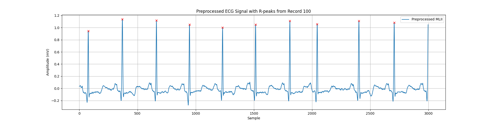
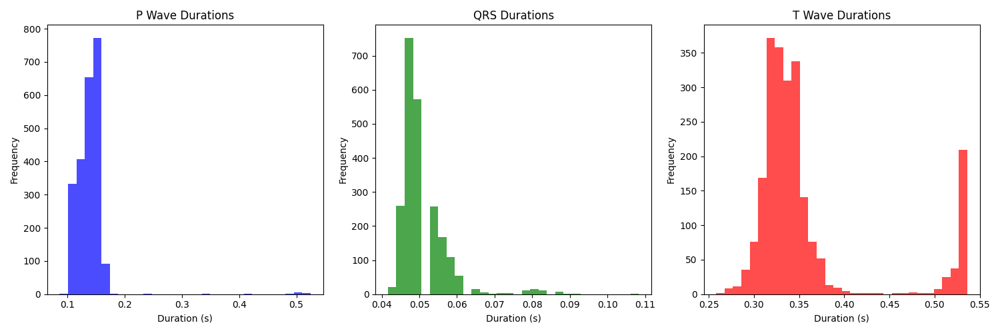

# ECG Signal Waveform Detection

This project provides a comprehensive analysis of ECG signals from the MIT-BIH Arrhythmia Database. The analysis includes preprocessing, time-domain analysis, and waveform detection such as R-peaks, Q, S, P, and T points.

## Introduction

The goal of this project is to preprocess ECG signals, perform time-domain analysis, and detect key waveform components. The processed data and detected features are crucial for understanding heart function and identifying potential arrhythmias.

## Data Loading and Preprocessing

The ECG signals were loaded from CSV files generated from the MIT-BIH Arrhythmia Database. The preprocessing steps include filtering to remove noise, baseline wandering correction, and normalization of the signal amplitude.
• **Bandpass Filter**: This function applies a bandpass filter to the ECG signal to remove noise. The filter passes frequencies between the lowcut and highcut values, which are normalized by the Nyquist frequency.
• **High-pass Filter**: This function applies a high-pass filter to remove baseline wandering from the ECG signal.


## Time-Domain Analysis

### Basic Statistics

- **Mean**: 0.000197
- **Median**: -0.026
- **Standard Deviation**: 0.171
- **Variance**: 0.029

### R-Peak Detection

The R-peaks were detected using the `find_peaks` function from the `scipy.signal` module. The detected R-peaks are essential for further analysis and waveform detection. The find_peaks function from the scipy library is used to detect R-peaks in the ECG signal. The distance parameter ensures that peaks are sufficiently spaced apart, while the height parameter filters out smaller peaks.   



### Heart Rate and Moving Average Calculation

- **RR Intervals**: Time differences between successive R-peaks.
- **Heart Rate**: Inverse of RR intervals, converted to beats per minute.
- **Moving Average**: Calculated using convolution over a specified window size.

- **Mean RR Interval**: 0.7181 s
- **Standard Deviation of RR Intervals**: 0.1450 s

## Waveform Detection

### Q, S, P, and T Wave Detection

- **Q and S Waves**: Detected as minima around R-peaks.
- **P and T Waves**: Detected as maxima in broader intervals before and after R-peaks.

### Waveform Duration Calculation

- **P Wave Duration**: Interval between P and Q points.
- **QRS Duration**: Interval between Q and S points.
- **T Wave Duration**: Interval between S and T points.



- **Mean P wave duration**: 0.1656 s
- **Mean QRS duration**: 0.0514 s
- **Mean T wave duration**: 0.3598 s

## Summary

This project detailed the preprocessing, time-domain analysis, and waveform detection of ECG signals from the MIT-BIH Arrhythmia Database. The preprocessing steps included filtering and normalization, followed by R-peak detection and identification of Q, S, P, and T points. Time-domain analysis provided insights into heart rate variability, while waveform analysis offered measurements of P wave, QRS complex, and T wave durations.

## Files and Directories

- **images/**: Contains images used in this README for visualization.
- **preprocessed_eeg_data.npy**: Numpy array of preprocessed EEG data.
- **eeg_labels.npy**: Numpy array of EEG labels.
- **eeg_labels_binary.npy**: Numpy array of binary EEG labels.

## How to Run

1. Clone the repository:
    ```bash
    git clone https://github.com/yourusername/ECG_Signal_Analysis.git
    cd ECG_Signal_Analysis
    ```

2. Ensure you have the necessary dependencies installed:
    ```bash
    pip install -r requirements.txt
    ```

3. Run the analysis script:
    ```bash
    python analyze_ecg.py
    ```

## Dependencies

- numpy
- pandas
- scipy
- mne
- matplotlib


